# 행렬 Matrix

## 목차
1. [스칼라](#1-스칼라)
2. [벡터](#2-벡터vector)
3. [행렬](#3-행렬matrix)

<br>
<br>

## 1. 스칼라(Scalar)
스칼라는 크기(Magnitude) 으로 나타낼 수 있는 물리량을 의미  

스칼라는 벡터와 행렬을 구성하는 기본 원소를 의미하며, 하나의 숫자로 구성되어 있다.  

기호로는 **영문 기울인 소문자** 로 표기한다.
```python
## 정의 및 연산
# 스칼라 정의
x = 2


# 스칼라 덧셈
x = 2
y = 3
z = x + y


# 스칼라 뺄셈
x = 4
y = 3
z = x - y 


# 스칼라 곱셈
x = 5
y = 3
z = x * y


# 스칼라 나눗셈
x = 5
y = 2
z = x / y
```

<br>
<br>

## 2. 벡터(Vector)
벡터 = 스칼라의 집합 & 행렬을 구성하는 기본 단위.  
스칼라와는 달리 크기(Magnitude) 와 방향(Direction) 들을 나타내는 개념입니다.  
**굵은 소문자**를 표기에 사용

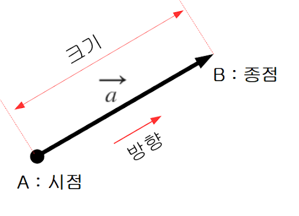  

행 벡터와 열 벡터로 나뉘며, 특별한 언급이 없으면 열 벡터를 의미한다.
크기와 방향이 없는 벡터는 '0'벡터(zero vector) 로 부른다.  
벡터에서 '-'부호를 붙인다는 것은 크기는 그대로 **방향만 반대**를 의미한다.

<br>

### 벡터의 덧셈과 뺄셈
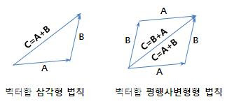

a + b = b + a  
두 벡터를 이용하면 평행사변형이 만들어진다는 사실을 알 수 있으며, 벡터의 덧셈 결과는 벡터의 시작 지점으로부터 평행사변형의 대각선을 구성하는 벡터임  

<br>

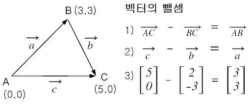

a - b = a + (-b)

a = b + (a - b)의 합집합으로 볼 수 도 있다.

### 파이썬 구현
```python
# 덧셈
u = [1, 2, 3]
v = [4, 5, 6]

n = len(u)
w = []

for i in range(0, n):
    val = u[i] + v[i]
    w.append(val)
    
>>>print(w)
[5, 7, 9]


# 덧셈 함수 구현
def v_add(u, v):
    """
    벡터의 덧셈
    input: 더하고자 하는 벡터 u, v
    output: 덧셈 결과 벡터 w
    """
    n = len(u)
    w = []

    for i in range(0, n):
        val = u[i] + v[i]
        w.append(val)
    
    return w
u = [7, 8, 9]
v = [12, 11, 10]

>>>v_add(u, v)
[19, 19, 19]


# 뺄셈
u = [1, 2, 3]
v = [4, 5, 6]

n = len(u)
w = []

for i in range(0, n):
    val = u[i] - v[i]
    w.append(val)
>>>print(w)
[-3, -3, -3]


# 뺄셈 함수 구현
def v_subtract(u, v):
    """
    벡터의 뺄셈
    input: 빼고자 하는 벡터 u, v
    output: 뺄셈 결과 벡터 w
    """
    n = len(u)
    w = []

    for i in range(0, n):
        val = u[i] - v[i]
        w.append(val)
    
    return w


u = [7, 8, 9]
v = [12, 11, 10]

>>>v_subtract(u, v)
[-5, -3, -1]
```
<br>

### 벡터의 곱셈과 뺄셈
벡터에 2를 곱한다는 것은 2배 만큼 크기가 커지는것을 의미.  
하지만 무조건 크키만 바뀔 뿐만 아니라, 방향도 바뀔 수 있다.  

<br>

- 벡터 기본 연산의 성질

> 벡터 u,v,w 그리고 스칼라 a,b 존재 할때, 다음과 같은 성질이 성립할 수 있다.

1. u + v = v + u
2. (u + v) + w = u + (v + w)
3. u + 0 = 0 + u = u
4. u + (-u) = 0
5. a(bu) = (ab)u
6. a(u + v) = au + av
7. (a + b)u = au + bu

```python
# 곱셈
u = [2, 4, 2]
a = 3

n = len(u)
w = []

for i in range(0, n):
    val = a * u[i]
    w.append(val)

>>>print(w)
[6, 12, 6]


# 곱셈 함수
def scalar_v_mul(a, u):
    """
    벡터의 스칼라 곱
    input: scalar a, vector list u
    output: 곱 결과 w
    """
    n = len(u)
    w = []

    for i in range(0, n):
        val = a * u[i]
        w.append(val)
    
    return w


u = [2, 4, 3]
a = 3

>>>scalar_v_mul(a, u)
[6, 12, 9]


## 벡터의 원소 곱
u = [1, 2, 4]
v = [7, 3, 2]

n = len(u)
w = []

for i in range(0, n):
    val = u[i] * v[i]
    w.append(val)

>>>print(w)
[6, 12, 9]


# 벡터 원소 곱 함수
def v_mul(u, v):
    """
    벡터의 원소 곱
    input: 곱하는 두 원수 u, v
    output: 곱한 벡터 w
    """
    n = len(u)
    w = []

    for i in range(0, n):
        val = u[i] * v[i]
        w.append(val)
    
    return w


# 나눗셈
u = [6, 5, 9]
v = [2, 2, -3]

n = len(u)
w = []

for i in range(0, n):
    val = u[i] / v[i]
    w.append(val)

>>>print(w)
[3.0, 2.5, -3.0]


# 나눗셈 함수
def v_div(u, v):
    """
    벡터 element-wise 나눗셈
    input: 나누고자 하는 벡터 u, v
    output: 나눈 결과값 벡터 w
    """
    n = len(u)
    w = []

    for i in range(0, n):
        val = u[i] / v[i]
        w.append(val)
    
    return w


u = [7, 5, -9]
v = [2, 2, 3]

>>>v_div(u, v)
[3.5, 2.5, -3.0]
```

<br><br>

### numpy 구현
```python
# 덧셈
import numpy as np

u = np.array([1,2,3])
v = np.array([4,5,6])
w = u + v
>>>print(w)
[5 7 9]


# 뺄셈
u = np.array([1,2,3])
v = np.array([4,5,6])
w = u - v
>>>print(w)
[-3 -3 -3]


# 스칼라 곱
a = 3
u = np.array([1,2,4])
w = a * u
>>>print(w)
[ 3  6 12]


# 원소 곱
u = np.array([1,2,4])
v = np.array([7,3,2])

w = u * v
>>>print(w)
[7 6 8]


# 나눗셈
u = np.array([6,5,-9])
v = np.array([2,2,-3])
w = u / v
>>>print(w)
[3.  2.5 3. ]
```

<br><br><br>

## 3. 행렬(Matrix)
행렬은 사각형 형태로 숫자를 나열하는 것을 의미.  
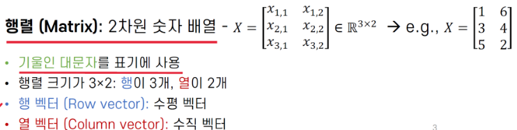

i : 행번호  
j : 열번호

<br>

### 행렬의 덧셈과 뺄셈
어떤 벡터가 다른 벡터와 덧셈이 가능하듯이, 행렬간에도 덧셈, 뺄셈도 가능하다.  

단, 각 행렬의 동일 위치에 대응하는 원소끼리 연산이 가능 그리고 이 때, 연산하는 원소의 행번호와 열번호가 동일해야 함.

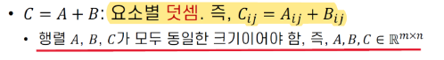

<br>

### 행렬의 스칼라 곱

Matrix scalar multiplicaton 은 스칼라와 행렬을 곱하는 '스칼라 X 행렬'을 의미한다.  
  

예를 들어 기존 행렬에 스칼라 2를 곱하는 것은 각 행벡터 나 열벡터가 2배로 늘어난다는 것을 의미한다.

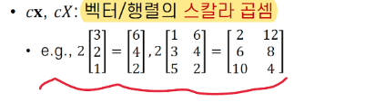

<br>

### 행렬의 원소 곱

Matrix element-wise multiplication 은 크기가 동일한 두 행렬에서 동일한 위치의 원소들끼리 서로 곱하는 것을 의미.  

단, 행렬의 원소 곱이 가능하려면 두 행령의 크기가 동일해야 함.


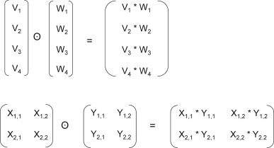

<br>

### 행렬 곱

Matrix multiplication 은 행렬 끼리 곱하는 것을 의미.  

행렬 곱은 일반적인 곱셈과 달리 전제 조건이 만족되어야 가능.  

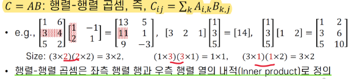  

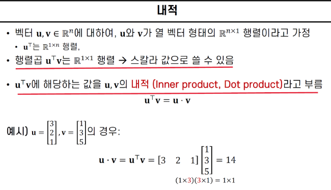  

<br>

-  행렬 연산의 특징

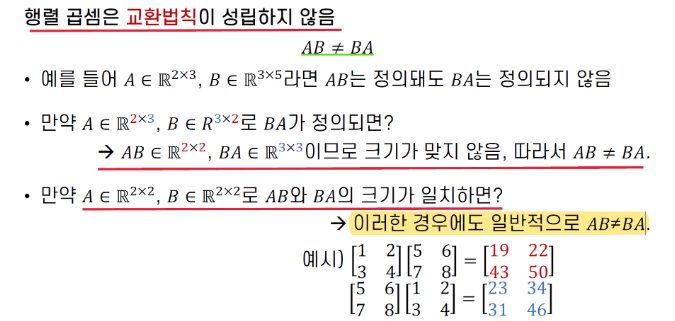 

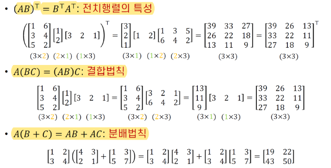

1. A+B = B+A
2. A+(B+C) = (A+B)+C
3. A(BC) = (AB)C
4. A(B+C) = AB+AC
5. (B+C)A = BA+CA
6. A(B-C) = AB-AC
7. (B-C)A = BA-BC
8. (B-C)A = BA-BC
9. a(B+C) = aB+aC
10. a(B-C) = aB-aC
11. (a+b)C = aC+bC
12. (a-b)C = aC-bC
13. a(BC) = (aB)C = B(aC)

<br>

### 행렬 대각합

행렬 A가 정사각 행렬일 때, 행렬 A의 대각합(trace) 대각 원소를 모두 더한 값을 의미합니다.  

tr(A)로 표기합니다.

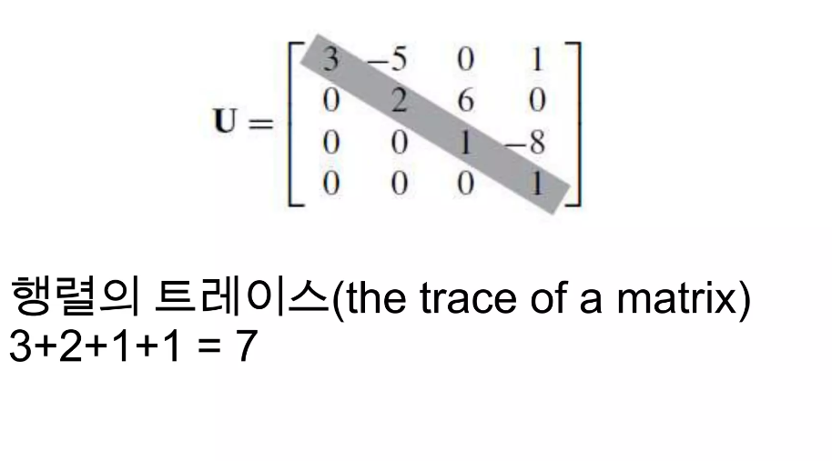

<br><br>

### 파이썬 구현

```python
# 행렬의 덧셈
A = [[2, 7], [3, 4], [6, 1]]
B = [[1, 4], [4, -1], [2, 5]]

n = len(A)
p = len(A[0])

res = []
for i in range(0, n):
    row = []
    for j in range(0, p):
        val = A[i][j] + B[i][j]
        row.append(val)

    res.append(row)

>>>print(res)
[[3, 11], [7, 3], [8, 6]]


## 함수
import m_func as f

>>>f.add(A,B)
[[3, 11], [7, 3], [8, 6]]


# 행렬의 뺄셈
A = [[2, 7], [3, 4], [6, 1]]
B = [[1, 4], [4, -1], [2, 5]]

n = len(A)
p = len(A[0])

res = []
for i in range(0, n):
    row = []
    for j in range(0, p):
        val = A[i][j] - B[i][j]
        row.append(val)

    res.append(row)

>>>print(res)
[[1, 3], [-1, 5], [4, -4]]

# 함수
import importlib
import m_func as f

importlib.reload(f) # m_func 모듈 다시 불러오기
>>>f.subtract(A,B)
[[1, 3], [-1, 5], [4, -4]]


# 행렬의 스칼라 곱
A = [[2, 7], [3, 4], [6, 1]]
b = 2

n = len(A)
p = len(A[0])

res = []
for i in range(0, n):
    row = []
    for j in range(0, p):
        val = b * A[i][j]
        row.append(val)

    res.append(row)

>>>print(res)
[[4, 14], [6, 8], [12, 2]]

>>>f.scalar_mul(b, A)
[[4, 14], [6, 8], [12, 2]]


# 행렬의 원소 곱
A = [[1, 5], [6, 4], [2, 7]]
B = [[5, -1], [1, 2], [4, 1]]

n = len(A)
p = len(A[0])

res = []
for i in range(0, n):
    row = []
    for j in range(0, p):
        val = A[i][j] * B[i][j]
        row.append(val)
    res.append(row)

>>>print(res)
[[5, -5], [6, 8], [8, 7]]

>>>f.ele_product(A, B)
[[5, -5], [6, 8], [8, 7]]


# 행렬 곱
A = [[2, 7], [3, 4], [5, 2]]
B = [[3, -3, 5], [-1, 2, -1]]

n = len(A)
p1 = len(A[0])
p2 = len(B[0])

res = []

for i in range(0, n):
    row = []
    for j in range(0, p2):
        val = 0
        for k in range(0, p1):
            val += A[i][k] * B[k][j]
        row.append(val)
    res.append(row)

>>>print(res)
[[-1, 8, 3], [5, -1, 11], [13, -11, 23]]

>>>f.matmul(A, B)
[[-1, 8, 3], [5, -1, 11], [13, -11, 23]]
```

<br>

### Numpy 구현

```python
import numpy as np

#행렬의 덧셈
A = np.array([[2, 7], [3, 4], [6, 1]])
B = np.array([[1, 4], [4, -1], [2, 5]])
C = A + B
>>>print(C)
[[ 3 11]
 [ 7  3]
 [ 8  6]]


# 뺄셈
C = A - B
>>>print(C)
[[ 1  3]
 [-1  5]
 [ 4 -4]]


# 스칼라 곱
b = 2
C = b*A
>>>print(C)
[[ 4 14]
 [ 6  8]
 [12  2]]


# 행렬의 원소 곱
A = np.array([[1, 5], [6, 4], [2, 7]])
B = np.array([[5, -5], [1, 2], [4, 1]])
C = np.multiply(A,B)
>>>print(C)
[[  5 -25]
 [  6   8]
 [  8   7]]


# 행렬 곱
A = np.array([[1, 5], [6, 4], [2, 7]])
B = np.array([[5, -5, 1], [2, 4, 1]])
C = np.matmul(A,B)
>>>print(C)
[[ 15  15   6]
 [ 38 -14  10]
 [ 24  18   9]]
```


