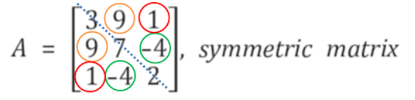
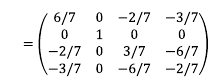

# 다양한 행렬

## 목차
1. [전치행렬](#전치행렬-transposed-matrix)
2. [대칭행렬](#대칭행렬-symmetric-matrix)
3. [대각행렬](#대각행렬-diagonal-matrix)
4. [항등행렬](#항등행렬--단위행렬-identity-matrix)
5. [영행렬](#영행렬-zero-matrix)
6. [삼각행렬](#삼각행렬-triangular-matrix)
7. [토플리츠행렬](#토플리츠행렬-toeplitz-matrix)
8. [이중대각행렬](#이중대각행렬-bidiagonal-matrix)
9. [하우스홀더](#하우스홀더-householder-matrix)

---

<br>
<br>

## 전치행렬 (Transposed matrix)

기존 행렬의 행과 열을 바꾼 행렬이다.

$$
u_{ij} -> u_{ji}
$$

- 전치행렬의 성질

$1. \quad (A^T)^T = A $ <br>
$2. \quad (A+B)^T = A^T + B^T $ <br>
$3. \quad (A-B)^T = A^T - B^T $ <br>
$4. \quad (aA)^T = aA^T $ <br>
$5. \quad (AB)^T = B^TA^T $ <br>

<br>

### 파이썬 구현

추가적인 파이썬으로 구현한 함수 method들은 "mm_func.py"를 통해 확인할 수 있다.

```python
>>> import mm_func as f
>>> A = [[1, 5], [3, 4], [6, 2]]

>>> f.transpose(A)
[[1, 3, 6], [5, 4, 2]]
```

### Numpy 구현
```python
>>> A = np.array([[1,5], [3,4], [6,2]])
>>> At = np.transpose(A)
>>> print(At)

[[1 3 6]
 [5 4 2]]
```

<br><br><br>

## 대칭행렬 (Symmetric matrix)



기존 행렬과 전치 행렬이 동일한 __정사각 행렬__ 을 의미한다.  
이와 같이 기존 행렬 $A$ 의 전치 행렬 $A^T$ 를 구해도 기존 행렬과 동일한 것을 알 수 있다.

- 대칭행렬의 특징

기본적으로 대칭행렬 두개가 존재할 때 대칭 행렬 간 <u>덧셈이나 뺄셈의 결과 또한 대칭 행렬</u>이다.

$$ 
A=\begin{pmatrix}
5 & 2 \\\\
2 & 1
\end{pmatrix} \quad  \quad 
B=\begin{pmatrix}
3 & 1 \\\\
1 & 4
\end{pmatrix}
$$

<br>

$$
A + B = \begin{pmatrix}
5 & 2 \\\\
2 & 1
\end{pmatrix} +\begin{pmatrix}
3 & 1 \\\\
1 & 4
\end{pmatrix} = \begin{pmatrix}
8 & 3 \\\\
3 & 5
\end{pmatrix}
$$

<br>

$$
A - B = \begin{pmatrix}
5 & 2 \\\\
2 & 1
\end{pmatrix} -\begin{pmatrix}
3 & 1 \\\\
1 & 4
\end{pmatrix} = \begin{pmatrix}
2 & 1 \\\\
1 & -3
\end{pmatrix}
$$

<br>

*물론 대칭 행렬끼리  행렬 곱한 결과는 반드시 대칭 행렬을 의미하는것은 아니다.*

또 다른 성질은 행렬$A$가 대칭 행렬일 때 대칭 행렬 $A$의 거듭 제곱 형태인 $A^n$ 또한 대칭 행렬이다.

<br>

선형대수학을 보다 보면 $AA^T$ 나 $A^TA$와 같은 형태로 자주 보인다. 이는 이 두 행렬의 결과 또한 <u>**대칭행렬 이라는 것**</u>이다.

<br>

### 파이썬 구현

```python
>>>A = [[1,0,2], [0,2,1], [2,1,1]]
>>>At = f.transpose(A)
>>>print(At)
[[1, 0, 2], [0, 2, 1], [2, 1, 1]]

>>>print(A==At)    # 둘이 정말 같은 행렬임을 볼 수 있다.
True


## AAt => 대칭행렬임을 보자.
>>>A = [[1,0,3], [2,1,4], [0,1,1]]
>>>At = f.transpose(A)

>>>print(f2.matmul(A, At))
[[10, 14, 3], [14, 21, 5], [3, 5, 2]]

>>>print(f2.matmul(At, A))
[[5, 2, 11], [2, 2, 5], [11, 5, 26]]
```

### Numpy
```python
## 대칭 행렬
>>>A = np.array([[1,0,2], [0,2,1], [2,1,1]])
>>>print(A)
[[1 0 2]
 [0 2 1]
 [2 1 1]]

>>>At = np.transpose(A)
>>>print(At)
[[1 0 2]
 [0 2 1]
 [2 1 1]]

>>>A == At
True

# 역행렬과의 곱이 대칭행렬?
>>>A = np.array([[1,0,3], [2,1,4], [0,1,1]])
>>>At = np.transpose(A)
>>>print(np.matmul(A, At))
[[10 14  3]
 [14 21  5]
 [ 3  5  2]]

>>>print(np.matmul(At, A))
[[ 5  2 11]
 [ 2  2  5]
 [11  5 26]]
```

<br><br><br>

## 대각행렬 (Diagonal matrix)


행렬의 주 대각 원소가 아닌 원소가 0인 정사각 행렬이다.  
<br>


대각 행렬은 주로 $D$로 표기, 대각 행렬의 역행령은 $D^{-1}$로 표기한다.  
그리고 주 대각 원소들의 역수로 구성된 것을 볼 수 있다.
<br>

- 대각 행렬의 성질


어떤 행렬 $A$에 대각행렬 $D$를 오른쪽에 곱하는 경우 기존 행렬의 열 값이 대각 원소의 배수가 된다.  
그리고 반대로 왼쪽에 곱하는 경우 기존 행렬의 행 값이 원소의 배수가 된다.

<br>

### 파이썬 구현
```python
A = [[1,2,3], [4,5,6], [7,8,9]]

n = len(A)
D = []

for i in range(0, n):
    row = []
    for j in range(0, n):
        if i == j:
            row.append(A[i][j])
        else:
            row.append(0)
    D.append(row)


# 일반행렬에 대각행렬을 곱했을 때
>>>A = [[1,2,3], [4,5,6], [7,8,9]]
>>>D = f.ele2diag([2,1,1])

>>>AD = f2.matmul(A,D)
>>>print(AD)
[[2, 2, 3], [8, 5, 6], [14, 8, 9]]

>>>DA = f2.matmul(D,A)
>>>print(DA)
[[2, 4, 6], [4, 5, 6], [7, 8, 9]]


>>>D = f.ele2diag([1,3,4])

>>>AD = f2.matmul(A,D)
>>>print(AD)
[[1, 6, 12], [4, 15, 24], [7, 24, 36]]

>>>DA = f2.matmul(D,A)
>>>print(DA)
[[1, 2, 3], [12, 15, 18], [28, 32, 36]]
```

### Numpy
```python
A = np.array([[1,2,3],[4,5,6],[7,8,9]])
D = np.diag(A)

>>>print(D)
[1 5 9]

>>>print(np.diag(D))   # 구한 대각원소를 다시 대각행렬함수에 넣으면, 행렬을 구할 수 있다.
[[1 0 0]
 [0 5 0]
 [0 0 9]]

D = np.diag([1,3,4])
>>>print(D)
[[1 0 0]
 [0 3 0]
 [0 0 4]]


AD = np.matmul(A,D)
>>>print(AD)
[[ 1  6 12]
 [ 4 15 24]
 [ 7 24 36]]

DA = np.matmul(D,A)
>>>print(DA)
[[ 1  2  3]
 [12 15 18]
 [28 32 36]]
```

<br><br><br>

## 항등행렬 = 단위행렬 (Identity matrix)

 

다음과 같이 주 대각 원소가 1이고 그 밖의 나머지 원소는 모두 0인 대각 행렬을 의미  

항등행렬은 $I$라고 표기한다.  
그리고 항등행렬은 단위행렬이라고도 불른다.

<br>

- 항등행렬의 특징


행렬 $A$를 $I$에 어느 쪽에서도 곱해도 기존 행렬 $A$과 같다.

<br>

### 파이썬 구현

```python
A = [[1,2,3],[4,5,6],[7,8,9]]
I = f.identity(3)

AI = f2.matmul(A,I)

>>>print(AI)
[[1, 2, 3], [4, 5, 6], [7, 8, 9]]

IA = f2.matmul(I,A)

>>>print(IA)
[[1, 2, 3], [4, 5, 6], [7, 8, 9]]
## 동일하다
```

<br>

### Numpy

```python
I = np.identity(3)
>>>print(I)
[[1. 0. 0.]
 [0. 1. 0.]
 [0. 0. 1.]]

A = [[1,2,3],[4,5,6],[7,8,9]]
AI = np.matmul(A,I)
>>>print(AI)
[[1. 2. 3.]
 [4. 5. 6.]
 [7. 8. 9.]]

IA = np.matmul(I,A)
>>>print(IA)
[[1. 2. 3.]
 [4. 5. 6.]
 [7. 8. 9.]]
```

<br><br><br>

## 영행렬 (Zero matrix)

행렬 구성 원소가 모두 0일때, 해당 행렬을 **영 행렬**이라고 부른다.

<br>

- 영행렬의 특징


영 행렬을 더하거나 빼는 것은 기존 행렬의 값을 변화시키지 않으며 만약 기존 행렬에 영 행렬을 행렬에 곱한다면 결괏값 또한 영 행렬로 나타난다.

### 파이썬 구현

```python
>>>f.zero_mat(3, 2)
[[0, 0], [0, 0], [0, 0]]
```

### Numpy
```python
>>>Z = np.zeros((3,2))

>>>print(Z)
[[0. 0.]
 [0. 0.]
 [0. 0.]]
```

<br><br><br><br>

## 삼각행렬 (Triangular matrix)


행렬의 구성 원소가 삼각형 형태를 나타낸다.  
왼쪽 처럼 주 대각 원소 아래쪽에 있는 모든 원소가 0인 정사각 행렬 => **상 삼각 행렬**  
오른쪽 처럼 주 대각 원소 위쪽에 있는 모든 원소가 0인 정사각 행렬 => **하 삼각 행렬**

그리고 상 삼각 행렬의 역행렬은 하 삼각 행렬이 되고, 반대의 경우도 마찬가지이다.

### 파이썬 구현

```python
def u_tri(A):
    """
    상 삼각행렬 변환
    input: 상 삼각 행렬로 변환하고자하는 행렬 A
    output: 행렬 A를 상 삼각 행렬로 변환시킨 행렬 utri
    """
    n = len(A)
    p = len(A[0])
    utri = []

    for i in range(0, n):
        row = []
        for j in range(0, p):
            if i>j:
                row.append(0)
            else:
                row.append(A[i][j])
        utri.append(row)
    return utri

A = [[1,2,3],[4,5,6],[7,8,9]]

>>>print(f.u_tri(A))
[[1, 2, 3], [0, 5, 6], [0, 0, 9]]

>>>print(f.l_tri(A))
[[1, 0, 0], [4, 5, 0], [7, 8, 9]]
```

<br>

### Numpy
```python
A = np.array([[1,2,3],[4,5,6],[7,8,9]])
AU = np.triu(A)

>>>print(AU)
[[1 2 3]
 [0 5 6]
 [0 0 9]]

AL = np.tril(A)

>>>print(AL)
[[1 0 0]
 [4 5 0]
 [7 8 9]]
```

<br><br><br><br>

## 토플리츠행렬 (Toeplitz matrix)

 


$$
T_{i,j} = T_{i+1,\; j+1} = t_{i-j}
$$

위 와 같이 토플리츠 행렬 $A$를 살펴 보면 1행의 원소가 2행으로 가면서 한 열씩 오른쪽으로 이동하는 것을 볼 수 있다.  
이러한 토플리츠 행렬은 시계열 분석을 할 때 자주 사용된다. 시계열 데이터를 보면 시점에 따라 값이 나열되어 있는 형태이고, 이처럼 시계열 데이터를 행렬 형태로 변환할 때 토플리츠 행렬을 사용한다.

### 파이썬 구현
```python
def toeplitz(a, b):
    """
    토플리츠 행렬 변환
    input: 토플리츠 행렬로 변환하고자 하는 리스트 a, b
    output: 리스트 a, b를 이용해 만든 토플리츠 행렬 A
    """
    n1 = len(a)
    n2 = len(b)
    A = []
    for i in range(0, n1):
        row = []
        for j in range(0, n2):
            if i > j:
                row.append(a[i-j])
            else:
                row.append(b[j-i])
        A.append(row)
    return A

a = [1, 0, -2, -4]
b = [1, 3, 5, 7, 9]

>>>f.toeplitz(a,b)
[[1, 3, 5, 7, 9], [0, 1, 3, 5, 7], [-2, 0, 1, 3, 5], [-4, -2, 0, 1, 3]]
```

<br>

### Scipy 구현
Numpy에서는 토플리츠는 구현이 안되어 있어 <u>scipy 라이브러리를 사용</u>한다.

```python
from scipy.linalg import toeplitz    # numpy는 라이브러리 함수가 없음

A = toeplitz([1, 0, -2, -4], [1, 3, 5, 7, 9])

>>>print(A)
[[ 1  3  5  7  9]
 [ 0  1  3  5  7]
 [-2  0  1  3  5]
 [-4 -2  0  1  3]]
```

<br><br><br><br>

## 이중대각행렬 (Bidiagonal matrix)

대각 행렬과 비슷한 행렬인 이중대각행렬은 대각원소 뿐만 아니라 대각 원소의 바로 위쪽 혹은 아래쪽 원소가 0이 아닌 행렬이다.


### 파이썬 구현
```python
def u_bidiag(A):
    """
    upper bidiagonal 행렬
    input: 행렬 A
    output: 행렬 A의 upper bidiagonal 행렬 res
    """
    n = len(A)
    p = len(A[0])

    res = []
    for i in range(0, n):
        row = []
        for j in range(0, p):
            if i > j or j - i > 1:
                row.append(0)
            else:
                row.append(A[i][j])
        res.append(row)
    return res

A = [[1,2,1,3],[5,3,4,1],[2,1,7,9],[2,8,1,3]]

>>>print(f.u_bidiag(A))    # upper bidiagonal matrix
[[1, 2, 0, 0], [0, 3, 4, 0], [0, 0, 7, 9], [0, 0, 0, 3]]
```

<br>

### Numpy 구현
```python
A = np.array([[1,2,1,3],[5,3,4,1],[2,1,7,9],[2,8,1,3]])

# upper diagonal matrix
diag_ele = np.diag(A)   # [1 3 7 3]

>>>np.diag(diag_ele)
array([[1, 0, 0, 0],
       [0, 3, 0, 0],
       [0, 0, 7, 0],
       [0, 0, 0, 3]])


u_diag_ele = np.diag(A, k=1)    # k 는 원소 1칸위에 있는 원소를 의미    # [2 4 9]

>>>print(u_diag_ele)
array([[0, 2, 0, 0],
       [0, 0, 4, 0],
       [0, 0, 0, 9],
       [0, 0, 0, 0]])


np.diag(u_diag_ele, k=1)    # k 1칸 위에 위치 시킨 행렬을 구할 수 있음을 의미
u_diag = np.diag(diag_ele) + np.diag(u_diag_ele, k=1)

>>>print(u_diag)
[[1 2 0 0]
 [0 3 4 0]
 [0 0 7 9]
 [0 0 0 3]]
```

<br><br><br><br>

## 하우스홀더 (Householder matrix)

어떤 행렬을 다른 형태로 변환할 때  사용하는 행렬 중 하나이다.  
하우스 행렬은 정사각 행렬이며 <u>모든 열이 정규 직교(orthonomal)한다는 특징이 있다.</u>  

$$
H = I - 2 \frac{VV^T}{V^TV}
$$

하우스 홀더 행렬은 Vector $V$와 단위행렬 $I$ 로 구할 수  있다.


 

<br>

### 파이썬 구현
```python
def householder(v):
    """
    하우스홀더 행렬
    input: 하우스홀더 행렬을 생성할 리스트 v
    output: 하우스홀더 행렬 H
    """
    n = len(v)
    outer_mat = outer_product(v, v)
    inner_val = inner_product(v, v)
    V = []
    for i in range(0, n):
        row = []
        for j in range(0, n):
            val = (2/inner_val) * outer_mat[i][j]
            row.append(val)
        V.append(row)
    H = subtract(identity(n), V)
    return H

a = [1, 0, 2, 3]

>>>f.householder(a)
[[0.8571428571428572, 0.0, -0.2857142857142857, -0.42857142857142855],
 [0.0, 1.0, 0.0, 0.0],
 [-0.2857142857142857, 0.0, 0.4285714285714286, -0.8571428571428571],
 [-0.42857142857142855, 0.0, -0.8571428571428571, -0.2857142857142856]]
```

<br>

### Numpy
```python
v = np.array([1, 0, 2, 3])
n = len(a)
outer_mat = np.outer(v, v)
inner_val = np.inner(v, v)
I = np.identity(n)

H = I - (2/inner_val) * outer_mat

>>>print(H)
[[ 0.85714286  0.         -0.28571429 -0.42857143]
 [ 0.          1.          0.          0.        ]
 [-0.28571429  0.          0.42857143 -0.85714286]
 [-0.42857143  0.         -0.85714286 -0.28571429]]
```
