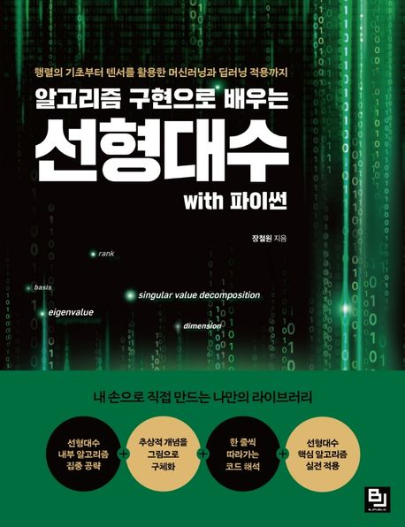

# Linear-Algebra

## 개요

장철원 강사님의 **"알고리즘 구현으로 배우는 선형대수 with Python"** 을 기반으로 한 study를 기록 및 저장합니다.  
Numpy의 Mathmetic을 python을 이용하여 라이브러리 없이 구현을 연습합니다.
 

<!-- 이미지 여기에 -->

 

 

## 진행
1. 수학 공부 및 내용 저장
2. 수학적 개념을 파이썬으로 구현합니다.
3. 똑같은 logic을 Numpy에서는 어떤 코드인지 다시 간편히 구현합니다.